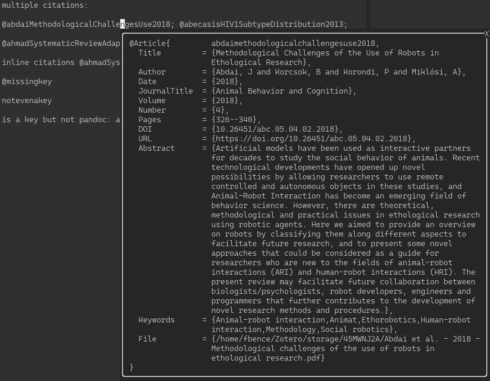
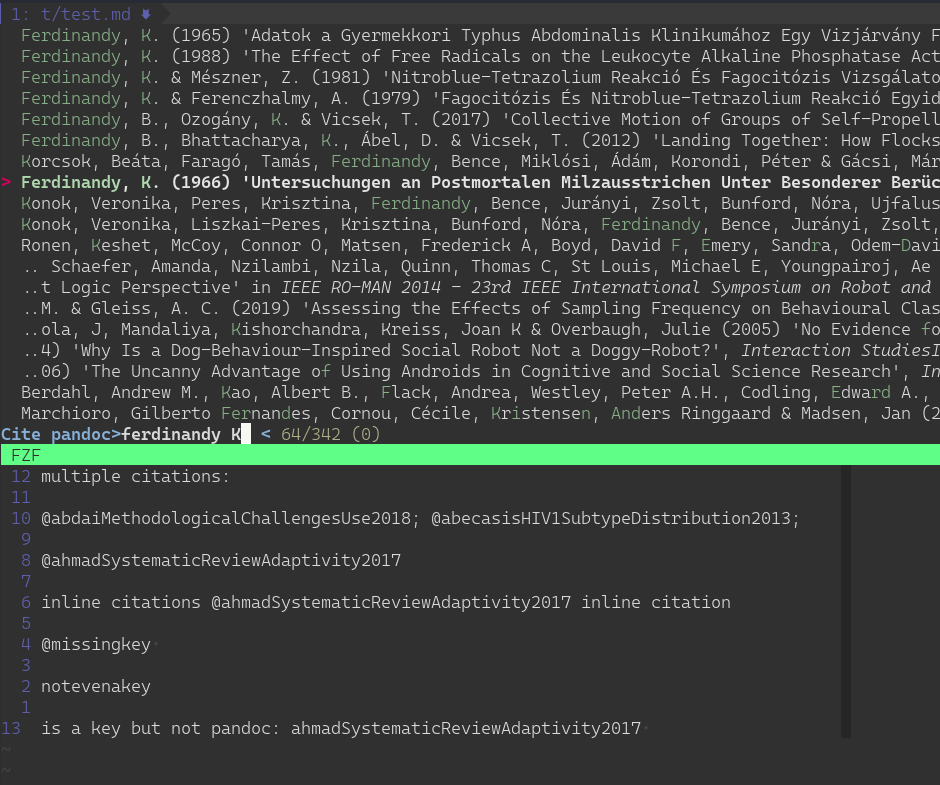

BIBTEXCITE.VIM
==============

A simple vim integration for [fzf-bibtex](https://github.com/msprev/fzf-bibtex)
 and [bibtool](https://ctan.org/pkg/bibtool)  for easy handling
of bib(la)tex citations. Insert citations in pandoc markdown, latex or
human-readable format. Fetch citation info in popup window or echo.

Fetch info


Insert citation


z
INSTALLATION
==============================================================================

For fetching citation info [bibtool](https://ctan.org/pkg/bibtool) is enough,
otherwise you need [fzf-bibtex](https://github.com/msprev/fzf-bibtex) .  Make
sure all the binaries (bibtool, bibtex-ls, bibtex-cite and bibtex-markdown) are
on your path.

Use your favorite plugin manager.

 - [vim-plug](https://github.com/junegunn/vim-plug)
   1. Add `Plug 'ferdinandyb/bibtexcite.vim'` to .vimrc
   2. Run `:PlugInstall`


USAGE
==============================================================================

g:bibtexcite_bibfile

 Can be either a string or a list of strings. Values will be used as paths to
  .bib files to be used.

b:bibtexcite_bibfile

  Buffer specific .bib files can also be set. This could be useful, although see
  |tips| for using a monolithical .bib file and then gathering all the actually
  used entries into a new .bib.

g:bibtexcite_openfilecommand

  Also works with buffer specific b:. Set the command to which file paths are
  passed when calling |BibtexciteOpenfile|. Defaults to `xdg-open`.

:BibtexciteInsert {citetype}

  Open an fzf search window for citations and insert them in the
  appropriate format. Multiple citations can be selected. It takes an optional
  {citetype} argument (default is "pandoc") from the following:

      - pandoc: @citekey1; citekey2
      - latex: \cite{citekey1, citekey2}
      - markdown: insert a human-readable entry
                authors (year) 'title' *journal* pages


:BibtexciteShowcite[!] {citetype}

  Fetch the citation info based on the citation key the cursor is on. The
  {citetype} is optional, which can either be "pandoc" or "latex". If the <cWORD>
  under the cursor is not a valid key for the citation type it will echo a message
  saying so. LaTeX citation keys are currently not matched if the cite command
  spans multiple lines. Using the command with the bang will try to use <cWORD> as
  key whether without any sanity checks.

:BibtexciteEchocite {citetype}

  Prints the bib entry, see tips for possible use case.

:BibtexciteOpenfile {citetype}

  If the citation has a file key in it, it will attempt to open the file with
  whatever is configured in |g:bibtexcite_openfilecommand|.


Configuration
==============================================================================
g:bibtexcite_floating_window_border

  Type: |List|
  Default: `['|', '-', '+', '+', '+', '+']`

  When set to `[]`, window borders are disabled. The elements in the list set
  the horizontal, top, top-left, top-right, bottom-right and bottom-left
  border characters, respectively.

  If the terminal supports Unicode, you might try setting the value to
  ` ['│', '─', '╭', '╮', '╯', '╰']`, to make it look nicer.

  Taken from ALE.

g:bibtexcite_close_preview_on_insert


  Type: |Number|
  Default: `0`

  When this option is set to `1`, bibtexcite's |preview-window| will be automatically
  closed upon entering Insert Mode.

  Taken from ALE.


TIPS
==============================================================================

Using one monolithical .bibfile managed by Zotero or Mendeley is the fastest way
to work, but you might need to include a .bib file for sharing later. In that
case, if you are working with latex the following will extract the entries from
the .aux file and place the in new.bib.

```
bibtool -x main.aux -o new.bib
```

If you are working with pandoc markdown the following will do the same:

```
grep -rPo "@\K[a-zA-Z0-9\-&_]+" *.md | xargs \
    -I{} bibtool -r biblatex -X {} monolithical.bib > new.bib
```

Using fzf to export some records from the bibfile to a new one:

 ```
 bibtex-ls ~/org/zotero.bib | fzf --multi | sed -nr 's/.+\b@([a-zA-Z0-9\-\&_])/\1/p' | ansi2txt | xargs  -I{} bibtool -r biblatex -X {} ~/org/zotero.bib
 ```

------------------------------------------------------------------------------
You can bind vim's default help key (K) to get the help if it exists, otherwise
show the citation info by putting this in your vimrc:

```
" Use K to show documentation in preview window.
nnoremap <silent> K :call <SID>show_documentation()<CR>

function! s:show_documentation()
  if (index(['vim','help'], &filetype) >= 0)
    execute 'h '.expand('<cword>')
  elseif (len(bibtexcite#getcitekey("pandoc")) > 1)
    call bibtexcite#showcite("pandoc")
  elseif (len(bibtexcite#getcitekey("latex")) > 1)
    call bibtexcite#showcite("latex")
  elseif (coc#rpc#ready())
    call CocActionAsync('doHover')
  else
    execute '!' . &keywordprg . " " . expand('<cword>')
  endif
endfunction
```

This also falls back to Coc.nvim-s show documentation, so if you are not using
it remove the correspoding elseif.

------------------------------------------------------------------------------

If you want to use the abstract in a citation entry, you can either do something
like this over a citekey:
```
:put =bibtexcite#getcite('pandoc')
```

or using [vim-backscratch](https://github.com/hauleth/vim-backscratch) `:Scratch BibtexciteEchocite` to put it on
a scratch buffer.


---------------------------------------------------------------------------

Possibly mappings:
```
autocmd FileType markdown  nnoremap <buffer> <silent> <leader>nc :BibtexciteInsert<CR>
autocmd FileType markdown  inoremap <buffer> <silent> @@ <Esc>:BibtexciteInsert<CR>
```

Acknowledgments
=============================================================================

The code for the popups was sourced from
[ALE](https://github.com/dense-analysis/ale), the code for the fzf chooser was
pretty much taken from the fzf-bibtex README.

LICENSE
==============================================================================

MIT

`autoload/bibtexcite/floating_preview.vim` is licensed separately in the file.
